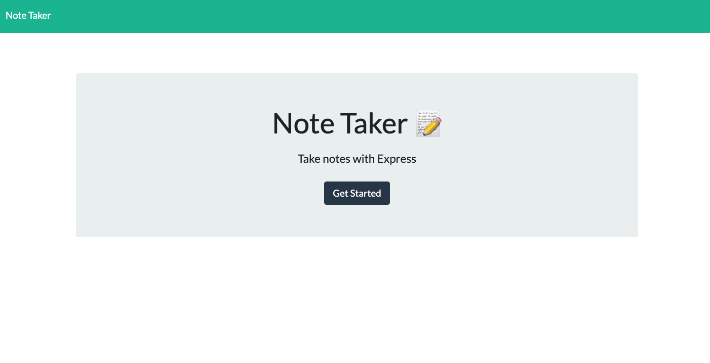
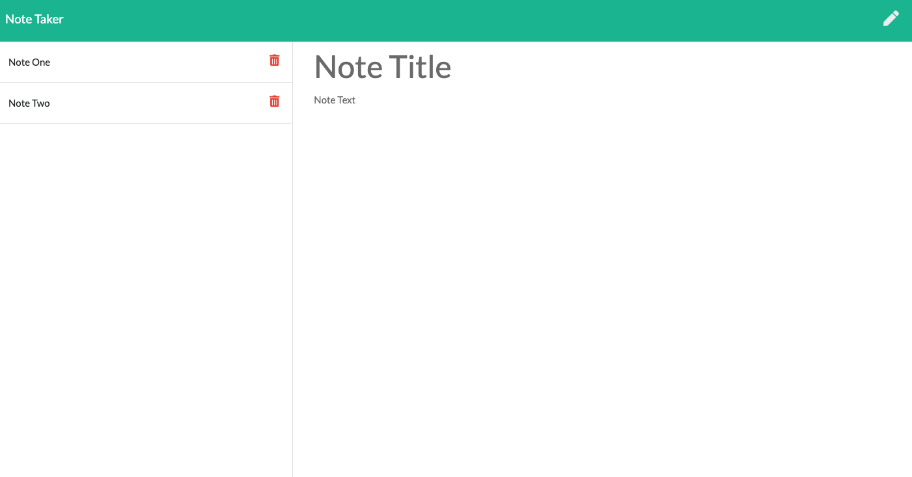

# Note Application 
 
### Description 
 A handy application for writing notes and storing the collection of a json file. 
### Table of Contents 
- [**Description**](#Description) 
- [**Installation**](#Installation) 
- [**Usage**](#Usage) 
- [**License**](#License) 
- [**Contributing**](#Contributing) 
- [**Tests**](#Tests) 
- [**Questions**](#Questions)
### Installation 
 Fork the repo and run 'nodemon server.js'. 
### Usage 
 NA 
### License 
This project is covered under the MIT license. 
### Contributing 
 NA 
### Tests 
 NA 
### Questions 
For additional projects and materials, go to ***[github.com/sassypigeon](https://github.com/sassypigeon)***. 
For additional questions, email me at ***mitchellmunderwood@gmail.com*** 

### Images

